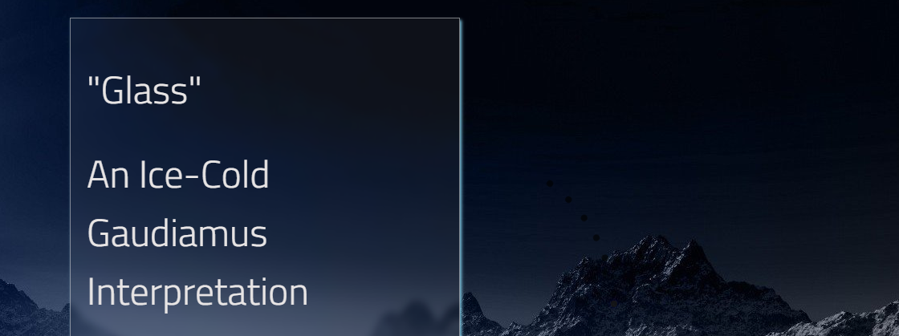

# Glass

Very simple gaudiamus example to build on top of. 

[live demo](https://gaudiamus-css.github.io/glass/)

## Use it:

1. fork this repository
2. clone & enjoy

## Requirements

- SASS (dartSass, as libSASS is deprecated and does not support some used features)

### First steps

The file `style/_variables.scss` is a good starting point. 
It includes common [Gaudiamus](https://gaudiamus-css.github.io) variables and controls values like
colors, breakpoints etc.

### Files

**_buttons.scss**

Handles button & icon behavior

**_card.scss**

Handles card glassmorphism

**_effects.scss**

Masking, clipping & scrollbar

**_form**

HTML form elements (input, textarea, select, checkbox)

**_menu**

Navbar & mobile menu

**_variables**

SCSS-variables

**style.scss**

Main stylesheet & font setup 

**components/toggle.js**

VanillaJS toggle e.g. for menu behavior. Should work nicely with all frameworks.